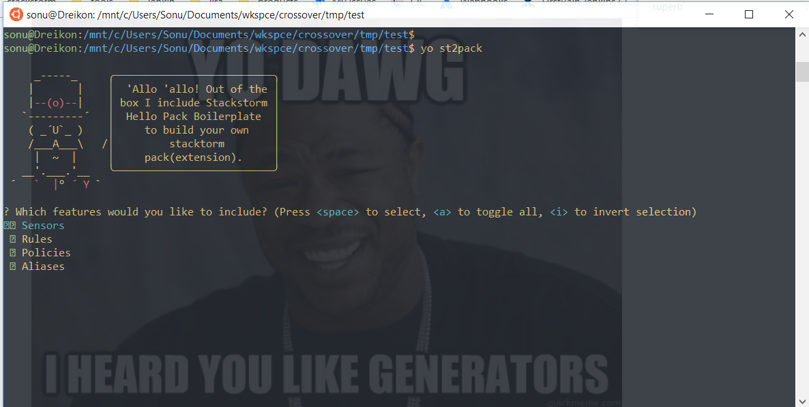

# Stackstorm Hello Pack generator

> [Yeoman](http://yeoman.io) generator that scaffolds out a stackstorm pack

## Features

* create scaffold for stackform pack: [hello_st2](https://docs.stackstorm.com/reference/packs.html#creating-your-first-pack)
* create scaffold for stackstorm action
* Generate README.md file out of `.yo-rc.json` file.

## Getting Started

- Install: `npm install --global yo generator-st2pack`
- Run `yo st2pack` to scaffold your stackstorm pack
- Run `yo st2pack:action` to scaffold stackstorm action
- Run `st2 pack install file:///$PWD` to install pack
- Commands like `st2 pack list`, `st2 action list`, `st2 rule list` and `st2 trigger list` will show you the loaded content. 

> Do no edit `yo-rc.yaml` file manually as it'll overwritten in next run. This file is read to generate README.md file for the scaffolded project.

*Follow [the official stackstorm guide](https://docs.stackstorm.com/reference/packs.html#submitting-a-pack-to-the-community) for more information on submitting stackstorm pack to community*

## Docs

* [getting started](docs/README.md) with this generator
* [contribution](contributing.md) docs and [FAQ](docs/faq.md), good to check before posting an issue

## Options

- `--skip-welcome-message`
  Skips Yeoman's greeting before displaying options.
- `--skip-install-message`
  Skips the the message displayed after scaffolding has finished and before the dependencies are being installed.
- `--skip-install`
  Doesn't automatically install dependencies after scaffolding has finished.
- `--test-framework=<framework>`
  Either `mocha` or `jasmine`. Defaults to `mocha`.

## Contribute

See the [contributing docs](contributing.md).

## License

[BSD license](http://opensource.org/licenses/bsd-license.php)